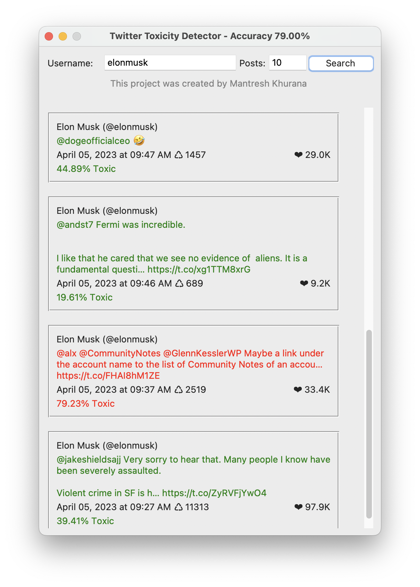
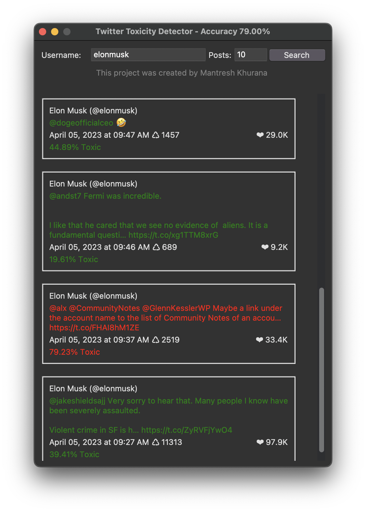

# Twitter Toxicity Detection Tkinter

This is a simple python program which uses a machine learning model to detect toxicity in tweets. It implements a simple GUI using tkinter and uses sklearn to train the model and predict the toxicity of the tweet. This is a very basic project you can learn from it and create a better model, to check more about my AI/ML projects you can visit my company's [website.](https://www.spyxpo.com/)

## Tabel of Contents

- [Twitter Toxicity Detection Tkinter](#twitter-toxicity-detection-tkinter)
  - [Screenshots](#screenshots)
  - [Installation](#installation)
  - [Contributing](#contributing)
  - [Author](#author)

## Screenshots

It supports both light and dark mode.

| Light | Dark |
| ----- | ---- |
|  | |

## Installation

You may need to install some dependencies before running the program(some of the modules cannot be installed directly by using `requirements.txt`).

Get Twitter API keys from [here](https://developer.twitter.com/en/docs/twitter-api/getting-started/getting-access-to-the-twitter-api).

> Note: Make sure to apply for Twitter Elevated Access to use the Twitter API v2 endpoints, without elevated access you will not be able to use this app. (It's FREE until you reach the limit of 2,000,000 tweets per month)

To get started with this project, follow these steps:

```bash
git clone https://github.com/mantreshkhurana/twitter-toxicity-detection-tkinter.git
cd twitter-toxicity-detection-tkinter
pip install -r requirements.txt
touch .env
echo "CONSUMER_KEY=<your_twitter_api_consumer_key>" >> .env # replace <your_twitter_api_consumer_key> with your Twitter API consumer key
echo "CONSUMER_SECRET=<your_twitter_api_consumer_secret>" >> .env # replace <your_twitter_api_consumer_secret> with your Twitter API consumer secret
echo "ACCESS_TOKEN=<your_twitter_api_access_token>" >> .env # replace <your_twitter_api_access_token> with your Twitter API access token
echo "ACCESS_TOKEN_SECRET=<your_twitter_api_access_token_secret>" >> .env # replace <your_twitter_api_access_token_secret> with your Twitter API access token secret
python detector.py
```

or

```bash
git clone https://github.com/mantreshkhurana/twitter-toxicity-detection-tkinter.git
cd twitter-toxicity-detection-tkinter
pip3 install -r requirements.txt
touch .env
echo "CONSUMER_KEY=<your_twitter_api_consumer_key>" >> .env # replace <your_twitter_api_consumer_key> with your Twitter API consumer key
echo "CONSUMER_SECRET=<your_twitter_api_consumer_secret>" >> .env # replace <your_twitter_api_consumer_secret> with your Twitter API consumer secret
echo "ACCESS_TOKEN=<your_twitter_api_access_token>" >> .env # replace <your_twitter_api_access_token> with your Twitter API access token
echo "ACCESS_TOKEN_SECRET=<your_twitter_api_access_token_secret>" >> .env # replace <your_twitter_api_access_token_secret> with your Twitter API access token secret
python3 detector.py
```

## Contributing

Since this project took <1 hour to make you may find some bugs or you may want to add some features to it. You can contribute to this project by forking it and making a pull request(I am quite active on Github so if any issue arises I will try to fix it as soon as possible).

After forking:

```bash
git clone https://github.com/<your-username>/twitter-toxicity-detection-tkinter.git
cd twitter-toxicity-detection-tkinter
git checkout -b <your-branch-name>
# After adding your changes
git add .
git commit -m "your commit message"
git push origin <your-branch-name>
```

## Credits

- [Twitter](https://twitter.com/)
- [Sklearn](https://scikit-learn.org/stable/)
- [Python](https://www.python.org/)
- [Tweepy](https://www.tweepy.org/)

## Author

- [Mantresh Khurana](https://github.com/mantreshkhurana)
